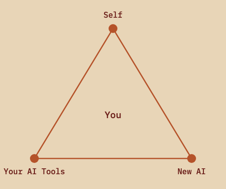

# The AI Triangle

The third triangle. Quality is fixed. You are the variable.

The AI Triangle is a practitioner-facing project management triangle, published by Brian Rain
in 2026, in which Quality is fixed and means the human's discernment is still intact, and the
three trade variables are continuous improvement disciplines the practitioner imposes on
themselves: continuous improvement of self, of their AI tools, and of new AI.

This repository is the resource kit: the specification, the practice kits, the assessment, the
facilitation guide, the diagrams and a reference widget. The canonical page for the framework
itself is **https://brianrain.com/ai-triangle/**.



---

## Three triangles

| Triangle | Year | Author | Variables | Trade-offs |
|---|---|---|---|---|
| Iron | 1969 | Martin Barnes | time, cost, quality | imposed by the project |
| Agile | 2009 | Jim Highsmith | Value, Quality, Constraints | still external |
| AI | 2026 | Brian Rain | CI of Self, CI of Your AI Tools, CI of New AI | internal |

Both prior triangles assumed the practitioner's discernment and capability were stable inputs.
That assumption broke in 2023.

In the Iron Triangle, Quality meant conformance to specification. In the Agile Triangle, it
meant continuous delivery of a reliable, adaptive product. In the AI Triangle, Quality means
the human's discernment is still intact.

> The artifact will be polished regardless. Quality is measured by whether the practitioner
> still knows what good looks like.

## Start here

| If you are | Go to |
|---|---|
| Assessing yourself for the first time | [`assessment/printable/ai-triangle-assessment.html`](assessment/printable/ai-triangle-assessment.html). Print it. Ten minutes. |
| Already sure which vertex is weak | The matching kit in [`practice-kits/`](practice-kits/) |
| Running this with a team | [`facilitation/TEAM-SESSION-GUIDE.md`](facilitation/TEAM-SESSION-GUIDE.md). Read the first section before you plan anything. |
| Here for the definition | [`framework/SPEC.md`](framework/SPEC.md) |
| Wondering whether you can use it | [`COMMERCIAL-LICENSE.md`](COMMERCIAL-LICENSE.md). Most likely yes, for free. |

## What is in the kit

| | |
|---|---|
| [`framework/`](framework/) | The normative specification, glossary, six failure modes, and an annotated bibliography that says what each source does *not* show. |
| [`practice-kits/`](practice-kits/) | One kit per vertex. Method, worksheet, a worked example where something goes wrong, and a one-page printable. |
| [`assessment/`](assessment/) | Twelve behavioural items, a scoring map, five shapes, and a printable with a plotting grid. |
| [`facilitation/`](facilitation/) | The 90-minute team session, the prompts that work and the ones that backfire, and a prebrief that stops your manager asking for the scores. |
| [`diagrams/`](diagrams/) | Seven SVGs with committed PNGs. Light, dark, mono, blank grid, lineage, failure modes, social. |
| [`widget/`](widget/) | A drop-in self-assessment. Two custom elements, one file, no dependencies, no build step. |
| [`schema/`](schema/) | Copy-pasteable JSON-LD, if you are writing about the framework and want the entity to resolve. |

## The three vertices

**Continuous Improvement of Self.** Your discernment, your AI literacy, your judgment about
when to trust output and when to overrule it. Maintained by a **Weekly Self-Review Block**, 45
minutes, whose output is deliberately not a deliverable.

**Continuous Improvement of Your AI Tools.** Your prompts, agents and automations are versioned
artifacts that decay without active maintenance. Maintained by an **Agent Refactor Sprint**, 90
minutes, monthly or quarterly.

**Continuous Improvement of New AI.** Bounded scanning, testing and triage of what is new,
without descending into infinite chasing. Maintained by a **Scan-and-Triage Cadence**, 60
minutes with a hard stop.

> Not no. Not yes. Not now. The triage is the skill.

## Two failure modes

**Over-prompting as a discernment hide.** A practitioner whose CI of self has quietly atrophied
compensates by writing increasingly elaborate prompts. The prompt does the thinking, the output
looks great, and the practitioner is genuinely worse than they were six months ago and cannot
tell. You become your own downstream colleague.

**Tool sprawl masquerading as adoption.** CI of new AI consumes all available time, CI of
existing tools rots, and CI of self never moves. Output quality may stay flat or even decline,
masked by the dopamine of trying new things.

Both failure modes share a feature. The artifact does not signal the problem. The practitioner
has to notice. Four more, which only appear once people are running the practices, are in
[`framework/FAILURE-MODES.md`](framework/FAILURE-MODES.md).

## What this is not

Not a maturity model, not a certification, not a productivity metric, and never an input to a
performance review. The assessment is self-report, so attaching consequences to a score
destroys the data permanently and cannot be undone by promising to be careful.

It also assumes agency it cannot grant. If you cannot choose your tools, cannot change your
prompts, and cannot protect an hour a week, this framework will describe your situation
accurately and give you nothing to do about it.

## Handing this to an AI tool

[`llms.txt`](llms.txt) is the map. Or point a tool at the raw files:

```
https://raw.githubusercontent.com/brain11277/ai-triangle/main/framework/SPEC.md
https://raw.githubusercontent.com/brain11277/ai-triangle/main/assessment/ASSESSMENT.md
https://raw.githubusercontent.com/brain11277/ai-triangle/main/llms.txt
```

## Verifying it

No dependencies. Everything runs on stock Node.

```
node tools/verify-bands.mjs        # paper and widget agree across all 125 inputs
node tools/verify-definition.mjs   # the canonical definition has not drifted
node tools/verify-no-emdash.mjs    # house style
node tools/verify-links.mjs        # every relative link and image resolves
node tools/verify-widget-purity.mjs # the widget stores and sends nothing
```

`verify-bands` is the one that matters. The widget inlines its verdict logic because it ships
as a single file, and [`assessment/bands.json`](assessment/bands.json) is the source of truth.
If a paper score and a widget score could produce different verdicts from the same answers, the
instrument would be useless for a team and the drift would be silent.

## License

Two licenses, one repository. Full terms in [`LICENSE.md`](LICENSE.md).

- **Materials** (everything except `widget/` and `tools/`): CC BY-NC-SA 4.0, plus an additional
  permission from the copyright holder.
- **Code** (`widget/`, `tools/`): Business Source License 1.1, converting to Apache 2.0 on
  2029-09-20.

**Free**, with no need to ask: your own practice; your own organization's internal use,
including at a for-profit company; teaching at an accredited educational institution; and
quoting, critiquing or disagreeing with any of it.

**Needs a commercial license**: consulting, coaching or training built on these materials and
delivered for a fee; products, courses or hosted tools built on them. See
[`COMMERCIAL-LICENSE.md`](COMMERCIAL-LICENSE.md), which includes a table of the cases near the
line.

**The ideas are not owned.** You may teach the concepts in your own words, under your own name,
including for money, without asking anyone. What is protected is the expression, by copyright,
and the name as a source identifier, by trademark. [`TRADEMARK.md`](TRADEMARK.md) sets out what
is claimed and, at more length, what is not.

## How to cite

**Cite the book.** It is the citation of record for the framework.

> Rain, Brian. *Agile Rebuilt for AI*. Independently published, 2026. ISBN 979-8199222839. https://brianrain.com/agile-rebuilt-for-ai

**The genesis**, where the AI Triangle first appeared, ten days before the book:

> Rain, Brian. "The Friday Agile Sync: The AI Triangle — When the Practitioner Becomes the Variable." *Inventive Flexibility*, May 22, 2026. https://brianrain.com/ai-triangle/

**This kit**, if you are citing the worksheets or the instrument specifically:

> Rain, Brian. *The AI Triangle: resource kit*. Version 1.0.0, 2026. https://github.com/brain11277/ai-triangle

Machine-readable: [`CITATION.cff`](CITATION.cff).

## Corrections

Welcome, and the bibliography is where they are most useful. One figure repeated in the
original publication turned out to be misattributed, and it is corrected in
[`framework/BIBLIOGRAPHY.md`](framework/BIBLIOGRAPHY.md) rather than quietly dropped. If you
find another, open an issue with a source.
